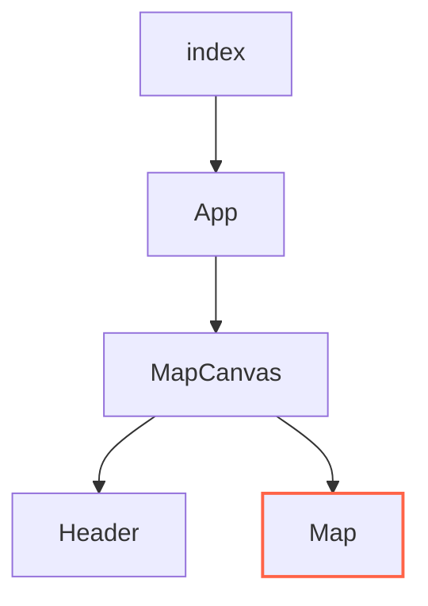

# Three.js Starter Pack
This is a simple Three.js project that will help you get up and running with Three.js and Vite.

The project contains:
1. A Blender file.
2. A gltf model.
3. A PBR material.

# Blender File
I have added the Blender file to have a base to work with and the scale will match between Blender and Three.js. 

# Structure

# Map
This component is where all the Three.js logic resides.
  