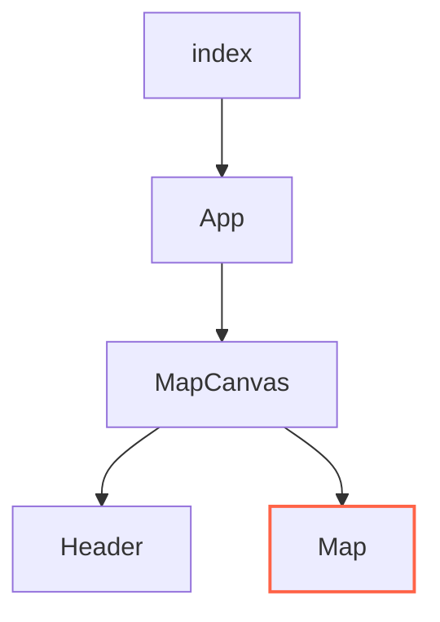

# Three.js Starter Pack
This is a simple Three.js project that will help you get up and running with Three.js and Vite.

Check out a preview here: [Three JS Starter Pack](https://three-js-starter.graememorgan.com/)

The project contains:
1. A gltf model.
2. A PBR material.

# Blender Scale
You may need to scale up or scale down models that are imported from 3D software. The gltf file may work to help set your scale in your software. 

# Structure

# Map
This component is where all the Three.js logic resides.
  